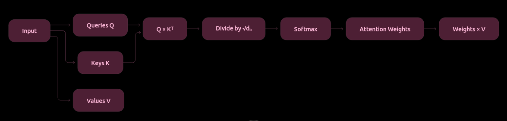

What Q, K, V mean
Q → What am I looking for?
K → What do I contain?
V → What information do I provide?

Why Scaling?
$$ \frac{QK^T}{\sqrt{d_k}} $$

Large dot products can make softmax too sharp and produce very small gradients.

Scaling keeps the values in a more suitable range.

Key Takeaway

Attention determines how much information each token should receive from every other token.