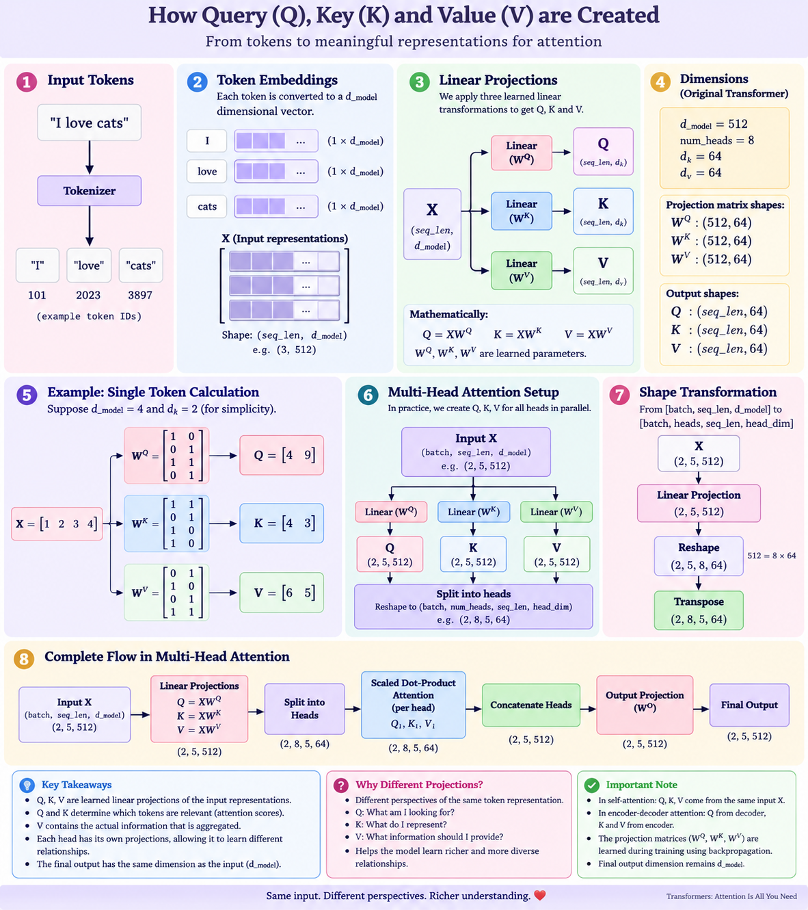

Q, K, and V are learned projections of the input representation. Q and K determine attention scores, while V provides the information that is weighted and aggregated to produce the attention output.

## Research Extension — Separate vs Fused QKV Projection

### Original Transformer: Separate Q, K, V Projections

In the original Transformer formulation, the input representation `X` is transformed independently to create the Query, Key, and Value representations.

```text
                X
                │
        ┌───────┼───────┐
        ↓       ↓       ↓
       WQ      WK      WV
        ↓       ↓       ↓
        Q       K       V
        │       │       │
        └───────┼───────┘
                ↓
             Attention

Mathematically:

$$ Q = XW^Q $$ $$ K = XW^K $$ $$ V = XW^V $$

Here, WQ, WK, and WV are three different learned weight matrices. During training, these matrices are updated through backpropagation so that the model learns useful query, key, and value representations.

For example, if:

X.shape = [batch, seq_len, d_model]

then:

WQ.shape = [d_model, d_k]
WK.shape = [d_model, d_k]
WV.shape = [d_model, d_v]

and therefore:

Q = X @ WQ
K = X @ WK
V = X @ WV

The important point is that the same input X is passed through three different learned transformations.


Modern Implementation: Fused QKV Projection

In many modern Transformer implementations, instead of performing three separate linear layers, Q, K, and V are produced using one larger linear projection.

Instead of:

X → WQ → Q
X → WK → K
X → WV → V

we perform:

X
↓
One Linear Layer
↓
[Q | K | V]
↓
Split
↓
Q    K    V

The idea is to combine the three weight matrices into one larger matrix:

$$ W^{QKV} = [W^Q \; W^K \; W^V] $$

Then:

$$ XW^{QKV} $$

produces all three representations at once:

        X
        │
        ▼
   Fused QKV Linear
        │
        ▼
   [ Q | K | V ]
      /   |   \
     Q    K    V


     The fused projection does not change the mathematical idea of attention.

The model still learns three different transformations.

The fused matrix simply stores the three projection matrices together.

Therefore, the resulting Q, K, and V can be mathematically equivalent to those produced by three separate linear layers, assuming the corresponding weights are arranged appropriately.

Why Use a Fused Projection?

The main reason is computational efficiency.

A Transformer performs Q, K, and V projections for many tokens and many batches. Instead of launching three separate matrix multiplication operations, an implementation can perform one larger matrix multiplication and then split the result.