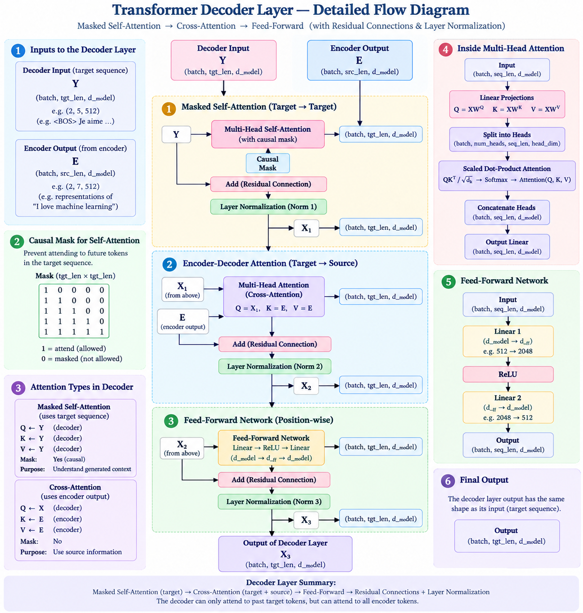

# Phase 7 — Decoder Layer

## Goal

Build one Transformer decoder block.

## Architecture

```text
Decoder Input
      ↓
Masked Self-Attention
      ↓
Residual + LayerNorm
      ↓
Encoder-Decoder Cross-Attention
      ↓
Residual + LayerNorm
      ↓
Feed-Forward Network
      ↓
Residual + LayerNorm
      ↓
Decoder Output
```
